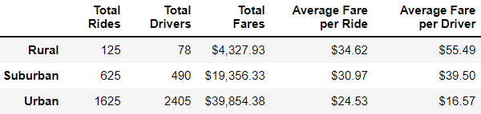
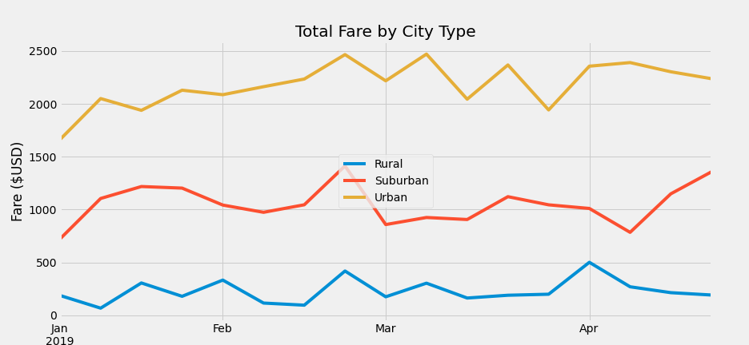

# PyBer_Analysis

## Overview
Our most recent project with Pyber had us using Matplotlib to create several graphics that could be used to analyze ride share prices by city type, driver quantity, and customer volume. We recently obtained a new assignment that had use the previous data to provide additional insights as well as a new graphic.

### Purpose
For this project we used Pandas and Matplotlib to create a summary by city type from ride share data. We also created a line graph comparing the total weekly fare by city types. This was done to determine where resource should be allocated. 

## Results
From the summary dataframe that we created there were several insights that could be useful.

From the summary:

- There was a significantly lower amount of total rides and drivers for Rural and Suburban cities than Urban ones.
- The average fare per ride was higher for Suburban and Rural drivers.
- The average fare per driver was significantly higher in Rural and Suburban cities. 

From the line graph:

- Total Fare per Week by City Type seemed to follow a similar trend.
- Total Fare for Urban cities was significantly higher than Rural or Suburban cities.

## Summary
Although fares in Urban cities are much lower on average, they produce the largest portion of Total Fares. It may also be worth noting that for Urban cities the driver count is actually higher than the number of rides; this is not the case for Rural or Suburban cities. Based on the analysis here are a few suggestions:

- There may be some correlation of drivers to the average fare price and ride number. Appealing to potential drivers in Rural and Suburban settings may help to reduce Fare prices and attract more riders.
- Urban cities still draw the most riders but there are also a large quantity of drivers. It may be beneficial to focus more on advertising to riders and not as much to drivers.
- Based on the line graph, for all cities there seems to be less in Total Fares early in January. It may be beneficial to target riders around these times.

We could also benefit by having additional data about each ride. For example, having the distance for each ride or ride time which could vary by city type. This would also most likely contribute to average fare. Exploring the current data further, it might be interesting to see why there seems to be a spike in Total Fare around late February/early March. This time does not seem to coincide with any holiday. 